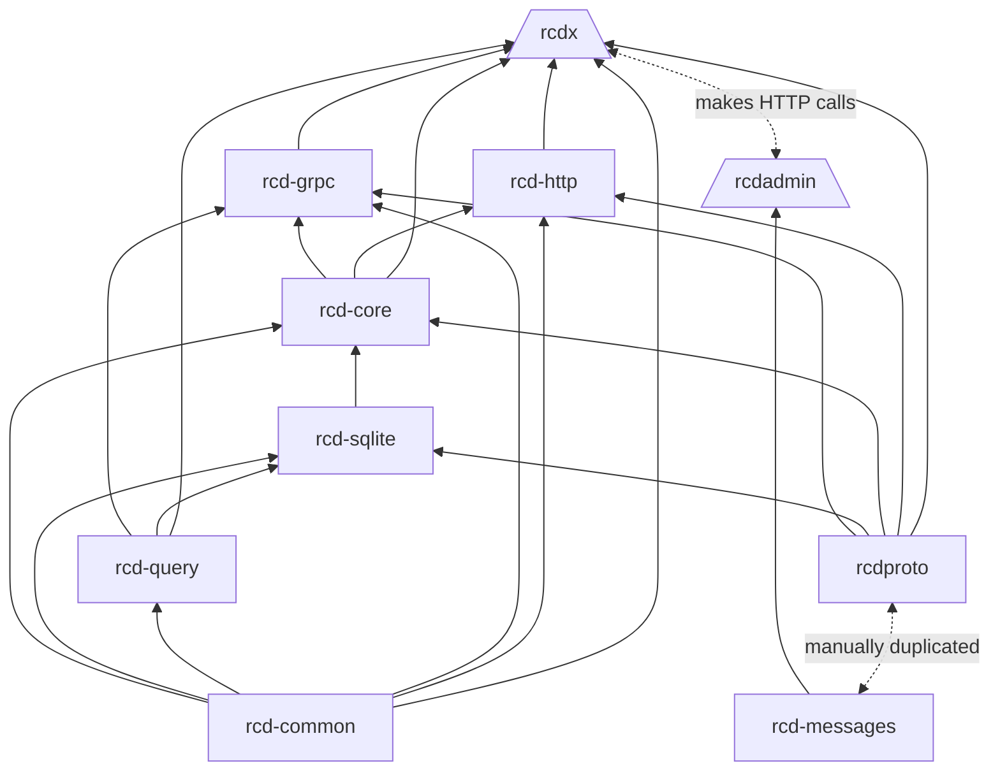

# rcd
"Relational Cooperative Data" or "Rust Cooperative Data."

An implementation of [dotCDS](https://github.com/dynamoRando/dotCDS), but done in Rust. I'm not a native Rust programmer, I'm learning as I go. 

CDS stands for "Cooperative Data System" or "Cooperative Data Store."

This software does not yet have a release.

# What is `rcd`
`rcd` is an intermediate API that sits on top of a database system that enables cooperation of data between the _author (or host)_ of a database and _participants_ of the database. Your application talks to `rcd`, and `rcd` talks to a local database and the corresponding _partial_ databases that are remote from the host.

`rcd` is currently being implemented on top of Sqlite, but Postgres is planned next along with MySql and Microsoft SQL Server. `rcd` is being written in Rust, and does not yet have a release.

# What is Cooperative Data
_Cooperative Data_ is a term used for the idea that usually the author of a database system often holds information that usually belongs to someone else. The common example is if a database author is building an online commerce storefront. The online store probably has records for inventory and customer information. In this example, the inventory information _belongs_ to the online retailer, but the customer information (such as Shipping Address, Billing Address, and so on) belong to the _customers_.

In this situation, `rcd` enables data to physically be split in a database system. Data that belongs to the online retailer will be saved in a database created by the online retailer, and data that belongs to the customers will be saved in databases that the customers choose to host elsewhere. To both, the database schema remains the same, and ownership and behavior of data is defined by a _database contract_.

The idea for `rcd` (and other related projects) is inspired by agricultural and/or food cooperatives.

# Project Layout

This project is currently going a reorganization.

## Former Libraries
- `rcdx` - the actual rcd binary that runs.
- `rcdproto` - library that implements the `rcdp.proto` file in Rust.
- `rcdclient` - library that is an abstraction over the `SQLClient` definition in the `rcdp.proto` file. This is intended to be used by other applications.

## New Layout
- `rcdx` - an executable that hosts both a `rcd-grpc` and a `rcd-http` layer.
- `rcd-core` - a library that contains the business logic for `rcd`. abstracts the client and data services and interactions with target database systems (Sqlite, MySQL, Postgres, etc.)
- `rcd-common` - a library that contains most objects shared by `rcd*` libaries.
- `rcd-sqlite` - a library that contains code specific to an `rcd*` implementation done in SQLite. As other databases are targeted other libraries will be added (MySQL, Postgres, etc).
- `rcd-query` - a library that defines functions to parsing SQL statements. This library currently only manages parsing SQLite, though it may be expanded to other SQL implementations (MySQL, Postgres, etc.)
- `rcd-grpc-client` - a replacement for `rcdclient`. This will be a native Rust lib that is an abstraction over the `rcdp.proto` and `rcdproto` lib.
- `rcdproto` - a Rust library that implements the `rcdp.proto` definition.
- `rcd-messages` - a duplicate library of `rcdproto`. this hopefully can be __deprecated__ - it only exists to allow common messages between the backend and `rcdadmin`, which targets the web assembly runtime and is incompatible with the current `proto` implementation (using `prost`.)
- `rcdt` - a binary for terminal interaction with an `rcdx` instance
- `rcd-http` - an HTTP API for `rcd-core`
- `rcd-grpc` - a gRPC API for `rcd-core`
- `rcdadmin` - a web assembly front end for managing an `rcd` instace. to be done in yew. will interact with an `rcdx` instance via HTTP calls.

# Other Referenced Projects
- Antlr, at [antlr.org](https://www.antlr.org/license.html) under BSD-3 license. Used for parsing SQLite statements
- gRPC, at [grpc.io](https://grpc.io/), under Apache 2.0 and Creative Commons 4.0. Used to implement the `proto` file.

# License
This software is licensed under the Apache 2.0 license. 

Copyright 2022 Randy Le.

# Library Relationships

The following mermaid diagram is constantly being revised. Generally, the relationships between binaries and libraries are described below.

- Binaries are described as trapezoids.
- Libaries are rectangles.

Originally, what is now the `rcd-grpc` library _was_ the entire `rcd` application, as `rcd` was intended to only work with gRPC. That is slowly being changed, such that:

- `rcdx` is the binary executable exposing both a `rcd-grpc` and a `rcd-http` API
- `rcdx` hosts a `rcd-core` layer
- `rcd-grpc` and `rcd-http` will respond to requests through the `rcd-core` layer

